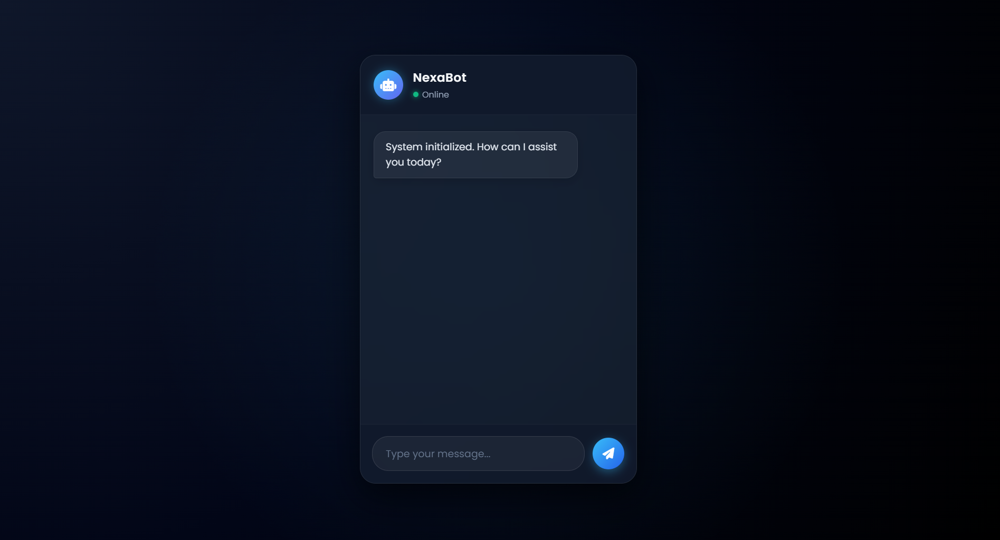
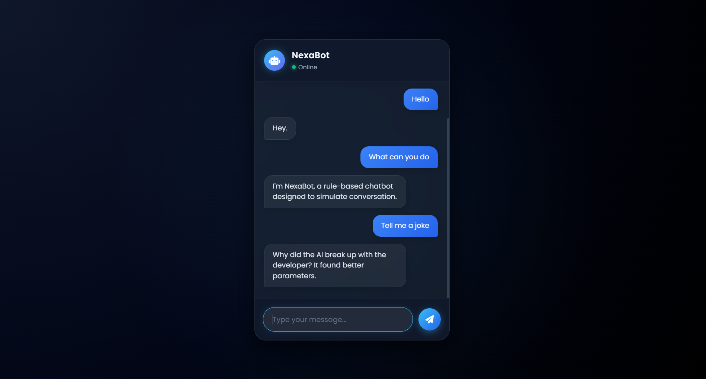

# Rule-Based Chatbot (Flask + RapidFuzz)

## Overview

This project is a rule-based chatbot web application built using Flask and vanilla JavaScript. It does not rely on machine learning models. Instead, it simulates conversational behavior using predefined rules, keyword scoring, fuzzy matching, and structured response logic.

The objective of this project is to demonstrate how conversational systems can be designed using traditional NLP techniques without requiring trained models.

---

## Features

* Rule-based intent recognition
* Keyword overlap scoring system
* Required-word validation for accurate responses
* Fuzzy greeting detection using RapidFuzz
* Randomized responses for conversational variation
* In-memory chat history storage
* Asynchronous frontend-backend communication using Fetch API
* Clean and responsive chat interface

---

## Tech Stack

* Backend: Python, Flask
* NLP Logic: RapidFuzz, Python `re`
* Frontend: HTML, CSS, Vanilla JavaScript
* UI Enhancements: Google Fonts, Font Awesome
* Utilities: Python `random`

---

## How It Works

### 1. Frontend Message Flow

The frontend sends user input to the `/chat` endpoint using the Fetch API. The message is immediately rendered in the UI while the backend processes the response.

### 2. Input Processing

User input is normalized using `clean_input()`:

* Converted to lowercase
* Tokenized using whitespace and punctuation

This ensures consistent rule matching.

### 3. Fuzzy Greeting Detection

Before rule scoring, the chatbot checks whether the input resembles greetings such as "hello" or "hi" using `rapidfuzz.fuzz.ratio`. This allows handling of minor spelling errors.

### 4. Rule-Based Scoring System

Responses are evaluated using `message_probability()` based on:

* Keyword matches
* Required words
* Response priority (single-response shortcuts)

The response with the highest score is selected.

### 5. Response Generation

The chatbot uses a combination of:

* Static responses (identity, capabilities, help, etc.)
* Random greetings
* Random jokes
* Fallback responses for unknown inputs

### 6. Chat Memory

All conversations are stored temporarily in memory using a Python list. The `/history` endpoint returns previous messages as JSON.

---

## Project Structure

```text
Rule-Based-Chatbot/
│── README.md
│── app.py
│
├── chatbot/
│   ├── logic.py
│   ├── memory.py
│   ├── responses.py
│
├── static/
│   ├── script.js
│   ├── style.css
│
└── templates/
    └── index.html
```

---

## Installation and Setup

```bash
git clone https://github.com/your-username/rule-based-chatbot.git
cd rule-based-chatbot
pip install -r requirements.txt
python app.py
```

Open the application in your browser:

```
http://127.0.0.1:5000
```

---

## Screenshots

### Chat Interface



### Conversation Example



---

## Limitations

* Chat history is stored in memory and resets when the server restarts
* Limited to predefined rules and keywords
* Cannot handle complex or unseen queries
* No contextual or long-term memory

---

## Future Improvements

* Persistent storage using a database (SQLite or MongoDB)
* Integration of machine learning or NLP models
* User authentication and session-based chat history
* Deployment to cloud platforms such as Render or AWS
* UI and interaction improvements

---

## Key Takeaway

This project demonstrates how conversational systems can be implemented using rule-based NLP techniques, forming a foundation for more advanced AI-driven chatbot systems.

---

## Contact

Prajit Ramachandran
Email: [ramachandranprajit@gmail.com](mailto:ramachandranprajit@gmail.com)

---

If you find this project useful, consider starring the repository.
